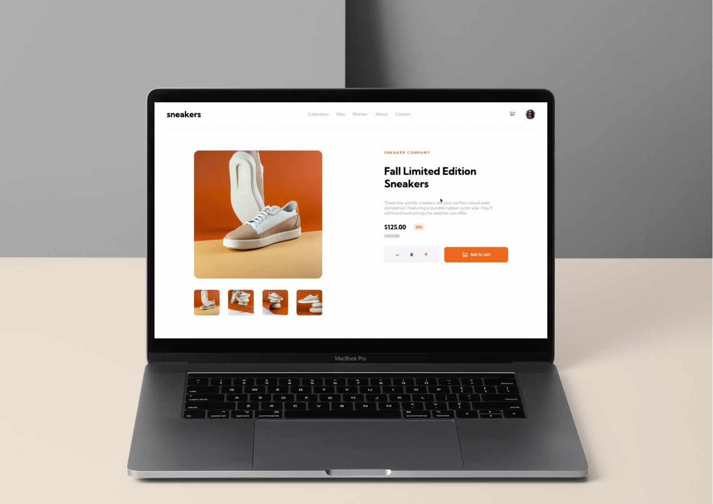

# Sneakers - E-commerce product page

This is a responsive e-commerce product page for sneakers. Users can add/remove items from the cart, view cart status, navigate product images, and open a modal for a larger image.

## Tech Stack

- HTML: The structure of the web page is created using HTML.
- SCSS: Styling and animations are done using SCSS (Sass).
- JavaScript: Vanilla JavaScript is used for all interactive and dynamic elements.
- GitHub Pages: The project is deployed and hosted on GitHub Pages.

## Deployment

Deployed with Github Pages.

_Link:_ https://fercfmsouza.github.io/Food-Order/

## Example Image

Here's some images of the application in action:

